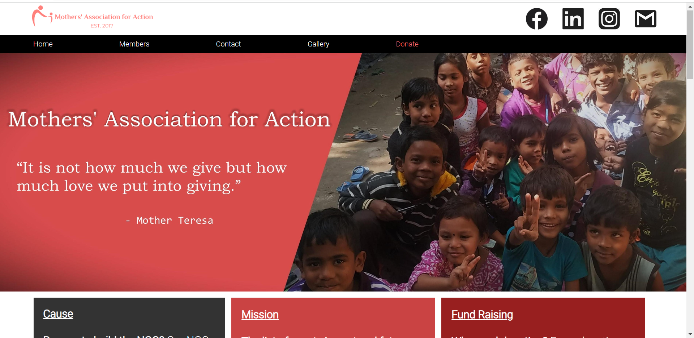

# Mother's Association for Action
### This is paid frontend project for a ngo which helps to educate under privileged children in the country.
##
[WEBSITE LINK: Mothers-Association-for-Action/](https://rohitgoswami853.github.io/Mothers-Association-for-Action/)
##
I have used pure html, css and js for the project to remove any extra deployment cost.

If you want you can go to their "donate" page and give some support.

You can also visit their instagram or "gallery" page to follow or join hands with the amazing works they do.

.png)
